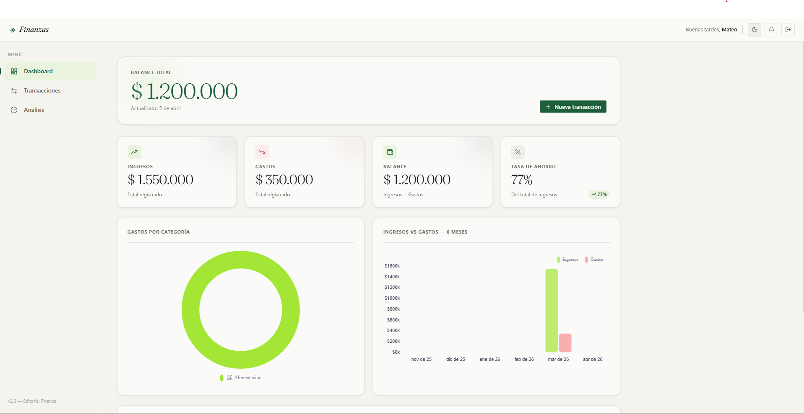

# Finance App

> Live site: **[finance-app-pi-three.vercel.app](https://finance-app-pi-three.vercel.app)**

A full-stack personal finance tracker. Log income and expenses, view summaries by category, and keep your finances organized with a clean, responsive interface.

---

## Preview



---

## Features

- Add and categorize income / expense transactions
- Financial summary dashboard (totals, balance)
- Filter by date and category
- REST API backend with persistent storage
- Responsive UI — works on mobile and desktop

---

## Tech stack

| Layer    | Technology              |
|----------|-------------------------|
| Frontend | JavaScript, CSS         |
| Backend  | Node.js, Express        |
| API      | REST (JSON)             |
| Storage  | JSON file / SQLite      |
| Deploy   | Vercel (frontend)       |

---

## Getting started

### Prerequisites

- Node.js 18+

### Backend

```bash
cd backend
npm install
npm start
# Runs on http://localhost:3000
```

### Frontend

```bash
cd frontend
# Open index.html in your browser, or use Live Server in VS Code
```

> Make sure the backend is running before opening the frontend.

---

## API reference

| Method | Endpoint            | Description                  |
|--------|---------------------|------------------------------|
| GET    | `/api/transactions` | Returns all transactions     |
| POST   | `/api/transactions` | Creates a new transaction    |
| DELETE | `/api/transactions/:id` | Deletes a transaction    |
| GET    | `/api/summary`      | Returns income/expense totals|

### Transaction object

```json
{
  "id": "uuid",
  "type": "income" | "expense",
  "category": "string",
  "amount": 150.00,
  "description": "string",
  "date": "2026-04-05"
}
```

---

## Project structure

```
finance-app/
├── backend/
│   ├── index.js        # Express server and route definitions
│   ├── routes/         # API route handlers
│   └── data/           # Persistent storage
└── frontend/
    ├── index.html      # App entry point
    ├── app.js          # Frontend logic and API calls
    └── style.css       # Styles
```

---

## What I'd improve with more time

- Add user authentication (JWT)
- Migrate storage to PostgreSQL
- Rewrite frontend in React with charts (Recharts or Chart.js)
- Add unit tests for API routes with Jest

---

## Contact

**Mateo Garcia** — Full-stack Developer  
[mathw.dev](https://mathw.dev) · [LinkedIn](https://www.linkedin.com/in/mateo-garcia-rodriguez-933135207/)